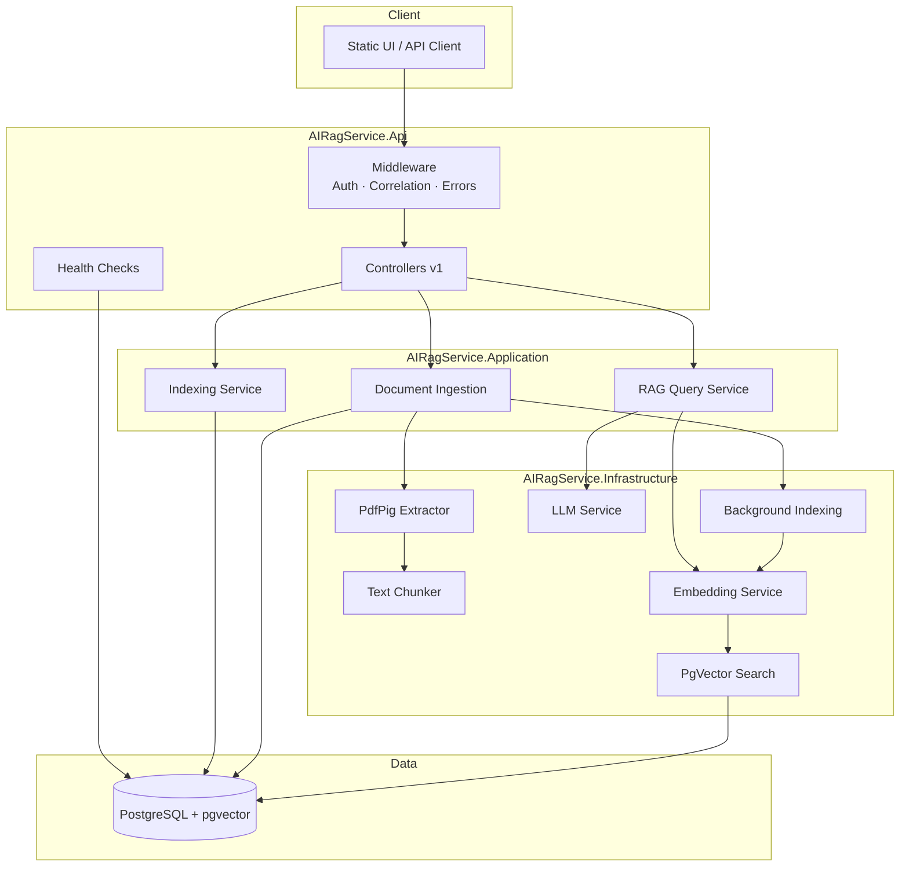

# AI RAG Service

Production-ready Retrieval-Augmented Generation (RAG) API built with ASP.NET Core. Upload PDF documents, index them with vector embeddings in PostgreSQL (pgvector), and query your knowledge base with semantic search and optional LLM-generated answers.

## Features

- **PDF ingestion** — Upload PDFs with validation, SHA-256 deduplication, and automatic text extraction (PdfPig)
- **Chunking** — Configurable chunk size and overlap for optimal retrieval
- **Vector indexing** — Background embedding generation with batching and retry logic
- **Semantic search** — pgvector cosine similarity search with optional document filtering
- **RAG queries** — Retrieve top-K chunks and optionally synthesize answers via OpenAI-compatible LLMs
- **Local embeddings** — Deterministic hash-based embeddings for development without API keys
- **REST API** — Versioned endpoints (`/api/v1/...`) with structured error responses
- **Rate limiting** — Per-IP limits on upload and query endpoints
- **API key auth** — Optional `X-API-Key` header protection
- **Health checks** — Liveness (`/health`) and readiness (`/health/ready`) with database probe
- **Observability** — Serilog structured logging, OpenTelemetry tracing/metrics, correlation IDs
- **Auto-migrations** — EF Core migrations applied on startup

## Architecture



### Request flow

1. **Upload** — PDF is validated, hashed, chunked, and stored. Indexing is queued.
2. **Index** — Background worker generates embeddings in batches and updates chunk vectors.
3. **Query** — Question is embedded, similar chunks are retrieved, and an LLM answer is generated (if configured).

## Tech stack

| Layer | Technology |
|-------|------------|
| Runtime | .NET 10, ASP.NET Core |
| Database | PostgreSQL 17 + [pgvector](https://github.com/pgvector/pgvector) |
| ORM | Entity Framework Core + Npgsql |
| PDF | UglyToad.PdfPig |
| Embeddings | Local hash (dev) or OpenAI-compatible API |
| LLM | OpenAI-compatible chat completions API |
| Logging | Serilog |
| Telemetry | OpenTelemetry |
| API docs | Swashbuckle (Swagger) |
| Resilience | Polly (HTTP retries) |
| Tests | xUnit, Testcontainers |

## Project structure

```
AIRagService/
├── Dockerfile
├── docker-compose.yml
├── .env.example
├── AIRagService.slnx
├── src/
│   ├── AIRagService.Api/           # HTTP host, middleware, controllers
│   ├── AIRagService.Application/   # Use cases, DTOs, configuration
│   ├── AIRagService.Domain/        # Entities, repository interfaces
│   └── AIRagService.Infrastructure/  # EF Core, PDF, embeddings, vector search
└── tests/
    ├── AIRagService.UnitTests/
    ├── AIRagService.ApiTests/
    └── AIRagService.IntegrationTests/
```

## Getting started

### Prerequisites

- [.NET 10 SDK](https://dotnet.microsoft.com/download)
- [Docker](https://www.docker.com/) (for containerized setup)
- PostgreSQL with pgvector (provided via Docker Compose)

### Local development (without Docker)

1. **Start PostgreSQL with pgvector**

   ```bash
   docker compose up postgres -d
   ```

2. **Configure environment**

   ```bash
   cp .env.example .env
   # Edit .env if needed (defaults work with docker-compose postgres)
   ```

3. **Run the API**

   ```bash
   dotnet run --project src/AIRagService.Api
   ```

   The API listens on `http://localhost:5110` (see `launchSettings.json`) or the port configured in `ASPNETCORE_URLS`.

4. **Verify health**

   ```bash
   curl http://localhost:5110/health
   ```

### Docker (full stack)

```bash
cp .env.example .env
docker compose up --build
```

- API: `http://localhost:8080`
- PostgreSQL: `localhost:5432`
- Migrations run automatically on API startup

## Environment variables

ASP.NET Core binds environment variables using `__` as a section separator (e.g. `Embedding__Provider`).

| Variable | Description | Default |
|----------|-------------|---------|
| `POSTGRES_DB` | PostgreSQL database name | `airagservice` |
| `POSTGRES_USER` | PostgreSQL user | `postgres` |
| `POSTGRES_PASSWORD` | PostgreSQL password | `postgres` |
| `POSTGRES_PORT` | Host port for PostgreSQL | `5432` |
| `API_PORT` | Host port for API | `8080` |
| `ASPNETCORE_ENVIRONMENT` | `Development` enables Swagger | `Development` |
| `ConnectionStrings__DefaultConnection` | Npgsql connection string | see `.env.example` |
| `Embedding__Provider` | `Local` or `OpenAI` | `Local` |
| `Embedding__Model` | OpenAI embedding model name | `text-embedding-3-small` |
| `Embedding__ApiKey` | OpenAI API key (required for OpenAI provider) | *(empty)* |
| `Embedding__BatchSize` | Chunks per embedding batch | `64` |
| `Embedding__Dimensions` | Vector dimensions (must match DB column) | `1536` |
| `Embedding__BaseUrl` | OpenAI-compatible embeddings endpoint | `https://api.openai.com/v1` |
| `Llm__Provider` | LLM provider identifier | `OpenAI` |
| `Llm__Model` | Chat model name | `gpt-4o-mini` |
| `Llm__ApiKey` | OpenAI API key (optional) | *(empty)* |
| `Llm__BaseUrl` | OpenAI-compatible chat endpoint | `https://api.openai.com/v1` |
| `Llm__Enabled` | Whether LLM calls are attempted | `true` |
| `Rag__ChunkSize` | Target characters per chunk | `800` |
| `Rag__ChunkOverlap` | Overlap between chunks | `120` |
| `Rag__TopK` | Default number of chunks to retrieve | `5` |
| `ApiKeyAuth__Enabled` | Require `X-API-Key` header | `false` |
| `ApiKeyAuth__ApiKey` | Expected API key value | *(empty)* |

Copy `.env.example` to `.env` and adjust values. Never commit real API keys.

## Docker

### Services

| Service | Image / Build | Port | Purpose |
|---------|---------------|------|---------|
| `postgres` | `pgvector/pgvector:pg17` | 5432 | Vector database |
| `api` | Built from `Dockerfile` | 8080 | ASP.NET Core API |

### Dockerfile

Multi-stage build:

1. **build** — Restore and publish `src/AIRagService.Api`
2. **final** — `mcr.microsoft.com/dotnet/aspnet:10.0`, exposes port 8080, runs as non-root (`$APP_UID`), includes `curl` for health checks

### Health checks

- **postgres** — `pg_isready`
- **api** — `curl -f http://localhost:8080/health`

The API service waits for PostgreSQL to be healthy before starting.

## API

Base path: `/api/v1`

### Documents

| Method | Path | Description |
|--------|------|-------------|
| `GET` | `/documents` | List documents (paginated, optional status filter) |
| `GET` | `/documents/{id}` | Get document with chunks |
| `POST` | `/documents` | Upload PDF (`multipart/form-data`, field: `file`) |
| `DELETE` | `/documents/{id}` | Delete document and chunks |
| `POST` | `/documents/{id}/index` | Re-queue indexing for a document |

### Query

| Method | Path | Description |
|--------|------|-------------|
| `POST` | `/query` | Semantic search + optional LLM answer |

**Request body:**

```json
{
  "question": "What is the refund policy?",
  "topK": 5,
  "documentIds": ["optional-guid-filter"]
}
```

**Response:**

```json
{
  "answer": "Based on the documents...",
  "sources": [
    {
      "documentId": "...",
      "fileName": "policy.pdf",
      "chunkId": "...",
      "pageNumber": 3,
      "content": "...",
      "similarity": 0.87
    }
  ]
}
```

### Stats

| Method | Path | Description |
|--------|------|-------------|
| `GET` | `/stats` | Dashboard statistics (document counts by status) |

### Health

| Path | Description |
|------|-------------|
| `/health` | Overall health (includes database) |
| `/health/ready` | Readiness probe |

### Rate limits

| Policy | Limit |
|--------|-------|
| `upload` | 10 requests / minute / IP |
| `query` | 60 requests / minute / IP |

## Swagger

Swagger UI is available in **Development** only:

- Local: `http://localhost:5110/swagger`
- Docker: `http://localhost:8080/swagger`

API key authentication can be configured in Swagger via the `X-API-Key` security scheme.

## UI

The API serves static files from `wwwroot` (when present). Place `index.html`, CSS, and JS there for a browser-based UI. Static assets and the root path are excluded from API key authentication.

## Testing

```bash
# All tests
dotnet test AIRagService.slnx

# Unit tests only
dotnet test tests/AIRagService.UnitTests

# API tests (WebApplicationFactory)
dotnet test tests/AIRagService.ApiTests

# Integration tests (Testcontainers + PostgreSQL)
dotnet test tests/AIRagService.IntegrationTests
```

CI runs restore, build, and test on every push/PR to `main` or `master` (see `.github/workflows/ci.yml`).

## Database and pgvector

- **Provider:** PostgreSQL 17 with the `vector` extension
- **ORM:** EF Core with `Npgsql.EntityFrameworkCore.PostgreSQL` and `Pgvector.EntityFrameworkCore`
- **Migrations:** Applied automatically on startup via `db.Database.MigrateAsync()`
- **Similarity:** Cosine distance (`<=>` operator); results expose `1 - distance` as similarity score
- **Schema:** `documents` and `document_chunks` tables; embeddings stored as `vector(1536)`

### Document lifecycle

| Status | Meaning |
|--------|---------|
| `Pending` | Uploaded, awaiting indexing |
| `Processing` | Embeddings being generated |
| `Indexed` | All chunks have embeddings |
| `Failed` | Indexing failed (see `errorMessage`) |

## Background indexing

Indexing runs asynchronously via `IndexingBackgroundService`:

1. Document upload queues a background task
2. Worker sets status to `Processing`
3. Chunks without embeddings are processed in batches (`Embedding__BatchSize`)
4. Transient embedding failures are retried up to 3 times with exponential backoff
5. Progress is tracked via `indexedChunkCount`
6. On success, status becomes `Indexed`; on failure, `Failed` with error message

Manual re-index: `POST /api/v1/documents/{id}/index`

## Observability

| Concern | Implementation |
|---------|----------------|
| Logging | Serilog → console, structured JSON-friendly output |
| Correlation | `X-Correlation-ID` header propagated on every request |
| Tracing | OpenTelemetry (ASP.NET Core + EF Core instrumentation) |
| Metrics | OpenTelemetry meters (`AIRagService`) |
| Health | `/health`, `/health/ready` with EF Core database check |

## Security

- **API key auth** — Optional; enable via `ApiKeyAuth__Enabled`. Send `X-API-Key` header.
- **Public paths** — Health, Swagger, static UI assets bypass auth.
- **Rate limiting** — Fixed-window per-IP limits on upload and query.
- **Input validation** — PDF-only uploads, max file size (20 MB), max chunks per document.
- **Deduplication** — SHA-256 content hash prevents duplicate document storage.
- **Non-root container** — API Docker image runs as `$APP_UID`.

## Configuration

Configuration is loaded from (highest priority last):

1. `appsettings.json`
2. `appsettings.{Environment}.json`
3. Environment variables
4. `.env` file (when using Docker Compose)

Nested JSON sections map to environment variables with `__`:

```
Embedding:Provider  →  Embedding__Provider
Llm:ApiKey          →  Llm__ApiKey
```

## Engineering decisions

| Decision | Rationale |
|----------|-----------|
| **Clean Architecture** | Separates domain, application, infrastructure, and API for testability and maintainability |
| **Local hash embeddings** | Enables full Docker Compose stack without external API keys; useful for CI and local dev |
| **Background indexing** | Keeps upload latency low; embedding batches avoid blocking HTTP requests |
| **pgvector in PostgreSQL** | Single database for relational data and vector search; mature ecosystem |
| **EF Core migrations on startup** | Simplifies deployment; database schema always matches application version |
| **Optional LLM** | Service remains useful for retrieval-only mode when `Llm__ApiKey` is unset |
| **Content-hash deduplication** | Prevents redundant storage and re-indexing of identical PDFs |
| **Polly retries** | Handles transient OpenAI rate limits (429) and server errors |
| **Rate limiting** | Protects embedding/LLM costs and prevents abuse |
| **Correlation IDs** | Enables end-to-end request tracing across logs |

## Troubleshooting

### API container exits or fails health check

- Ensure PostgreSQL is healthy: `docker compose ps`
- Check logs: `docker compose logs api`
- Verify connection string points to hostname `postgres` (not `localhost`) inside Docker
- Allow ~30s start period for migrations on first run

### `relation "documents" does not exist`

Migrations may have failed. Check API logs for EF Core errors. Ensure the PostgreSQL image is `pgvector/pgvector:pg17`.

### Embeddings / indexing stuck in `Processing`

- Check API logs for embedding errors
- With `Embedding__Provider=OpenAI`, ensure `Embedding__ApiKey` is set
- Re-queue: `POST /api/v1/documents/{id}/index`

### Query returns excerpts instead of LLM answer

`Llm__ApiKey` is not configured. Set a valid OpenAI API key or use retrieval-only mode intentionally.

### `401 Unauthorized`

`ApiKeyAuth__Enabled=true` requires `X-API-Key` header matching `ApiKeyAuth__ApiKey`.

### Port conflicts

Change `API_PORT` or `POSTGRES_PORT` in `.env` if 8080 or 5432 are already in use.

### Swagger not available

Swagger is enabled only when `ASPNETCORE_ENVIRONMENT=Development`.

### Vector dimension mismatch

`Embedding__Dimensions` must match the database column definition (`vector(1536)`). Changing dimensions requires a new migration.

## License

See repository license file (if applicable).
